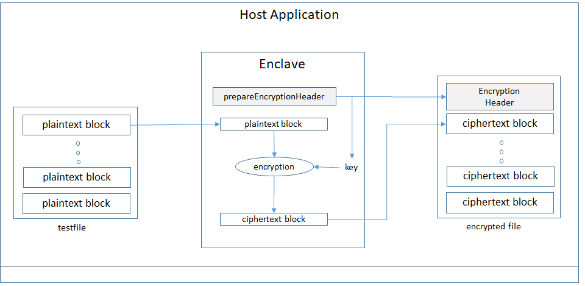

# The File-Encryptor Sample

 OE SDK comes with a default crypto support library that supports a [subset of the open sources mbedtls](/docs/MbedtlsSupport.md) library. This sample demonstrates how to perform simple file crypotology operations inside an enclave using mbedtls library.
   
It has the following properties:

- Written in C++
- Shows how to encrypt and decrypt data inside an enclave
- Shows how to derive a key from a password string [PBKDF2](https://en.wikipedia.org/wiki/PBKDF2)
- Uses AES mbedtls API to perform encryption and descryption
- Uses the following OE APIs
  - mbedtls_aes_setkey_*
  - mbedtls_aes_crypt_cbc
  - mbedtls_pkcs5_pbkdf2_hmac
  - mbedtls_ctr_drbg_random
  - mbedtls_entropy_*
  - mbedtls_ctr_drbg_*
  - mbedtls_sha256_*
  - oe_is_outside_enclave
- Also runs in OE simulation mode


## Host application

This sample is relatively straightforward, It's all about the use of the mbedtls library. 



The host application drives an enclave to perform the following operations

1. Creates an enclave from the host

2. Encrypts a testfile into out.encrypted file. It breaks an input file into 16-byte blocks. It then sends each block to the enclave for encryption one block after the other until the very last block is encountered. It makes sure the last block is padded to make it a 16-byte block, which was required AES-CBC encryption algorithm used by the enclave.

3. Decrypts the out.encrypted to out.decrypted file

    The decryption process is a reverse of the encryption except that it provides a encryption header to the encryptor in the enclave in its initialize_encryptor call, which contains a **encryption_header_t** (defined below), that has encryption metadata for the encryptor to validate its password and retrieve the encryption key from it.

   In the end, the host makes sure the contents of testfile and out.decrypted are identical; that is, the encryption and the decryption actual work as expected.

4. Terminate the enclave

## Enclave library

### ECALLs

  There are three ECALLs implemented inside the enclave library

### initialize_encryptor
```c
    int initialize_encryptor(
        bool encrypt,
        const char* password,
        size_t password_len,
        encryption_header_t* header)
```

  The bulk of the operations are done in this enclave call.

   Allocate resource and setup mbedtls for encryption and decryption operations. 
   
#### For encryption operation

   It does the following operations to generate encryption_header_t information for passing back the host to write into the encrypted file.

  ```c
  typedef struct _encryption_header
  {
      size_t fileDataSize;
      unsigned char digest[HASH_VALUE_SIZE_IN_BYTES];
      unsigned char encrypted_key[ENCRYPTION_KEY_SIZE_IN_BYTES];
  } encryption_header_t;
  ```

  - Generate a SHA256 digest for the input password, stored in digest field
  - Derive a password key from the input password
  - Produce an encryption key
  - Encrypt the encryption key with the password key, stored in encrypted_key field

See the following routine for details

```c
int ecall_dispatcher::prepare_encryption_header(
    encryption_header_t* header,
    string password)
```
    
#### For decryption operation 

 In decryption, instead of generating encryption_header_t information, initialize_encryptor uses the host provided encryption_header_t information to validate the input password and extract encryption key for later decryption operations.
 
 Here what it does:
 
 - Check password by comparing encryption_header_t.digest with the calculated hash of the input password
 - Derive a password key from the input password
 - Decrypt encryption_header_t.encrypted_key with the password key produced above, in preparing for upcoming decryption operations
 
 
 
See the following routine for details

```c
    int ecall_dispatcher::parse_encryption_header(
        encryption_header_t* header,
        string password)
```

#### encrypt_block
```c
    int encrypt_block(
        bool encrypt,
        unsigned char* input_buf,
        unsigned char* output_buf,
        size_t size)
```

Send a block of data to the enclave for encryption using the configuration setup up by the initialize_encryptor() call

#### close_encryptor()

```c
    void close_encryptor()
```
  
   Free all the source allocated as part of this encryptor instance.
 

## Build and run

To build a sample, change directory to your target sample directory and run "make build" to build the sample and run "make run" to run it.

For example:

     yourusername@yourVMname:~/openenclave/share/openenclave/samples$ cd file-encryptor
     yourusername@yourVMname:~/openenclave/share/openenclave/samples/file-encryptor$ make build
     yourusername@yourVMname:~/openenclave/share/openenclave/samples/file-encryptor$ make run
